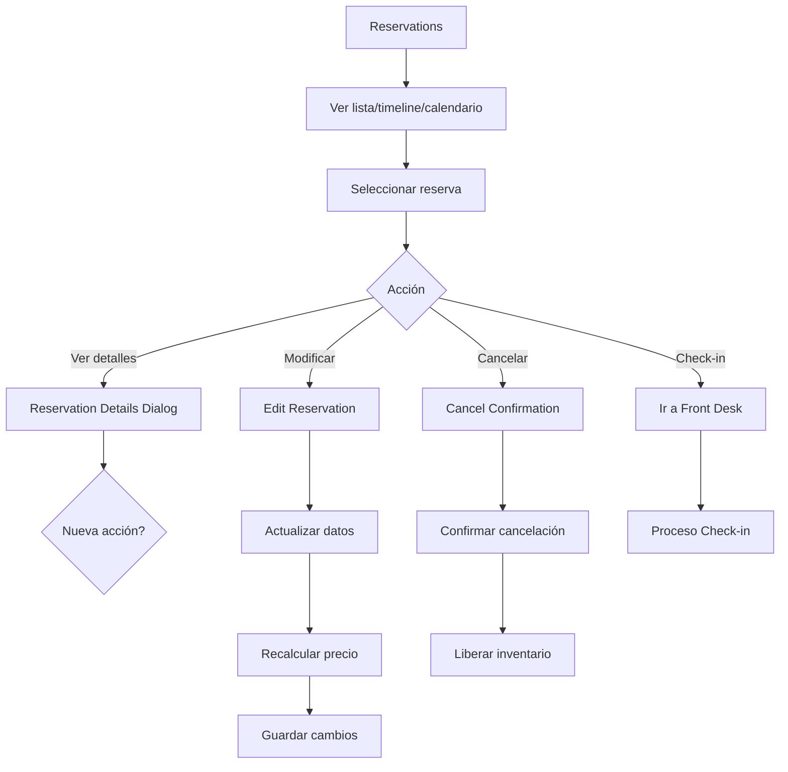
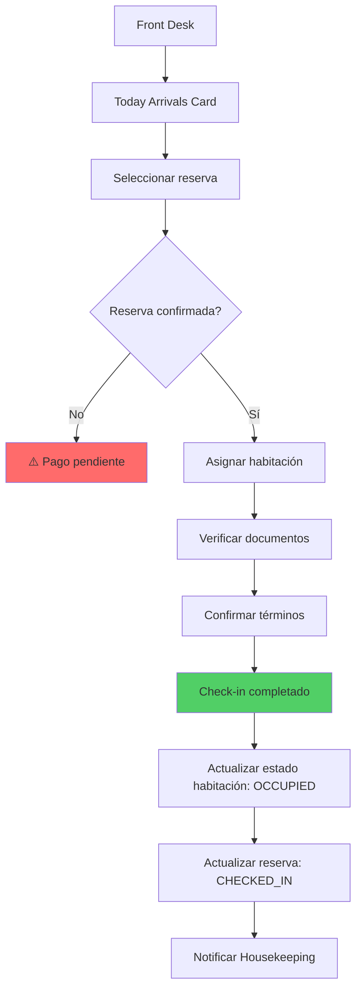
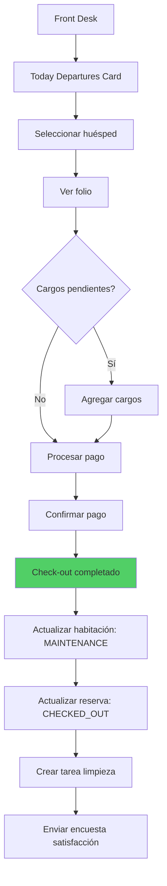
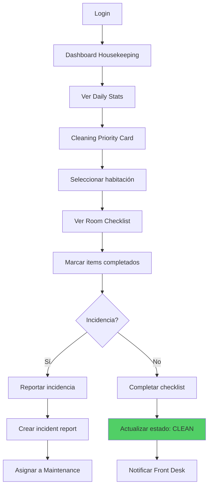
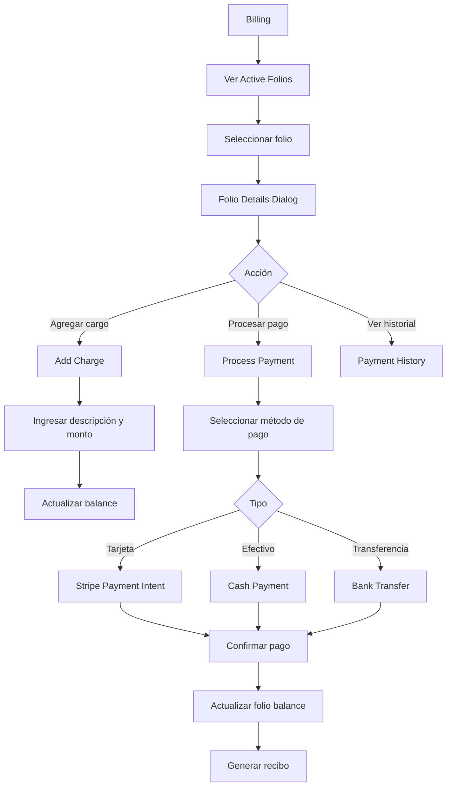
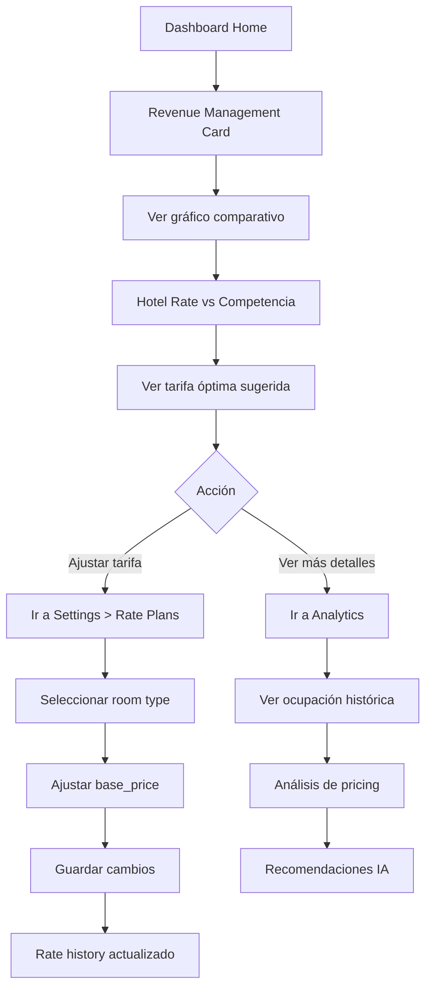
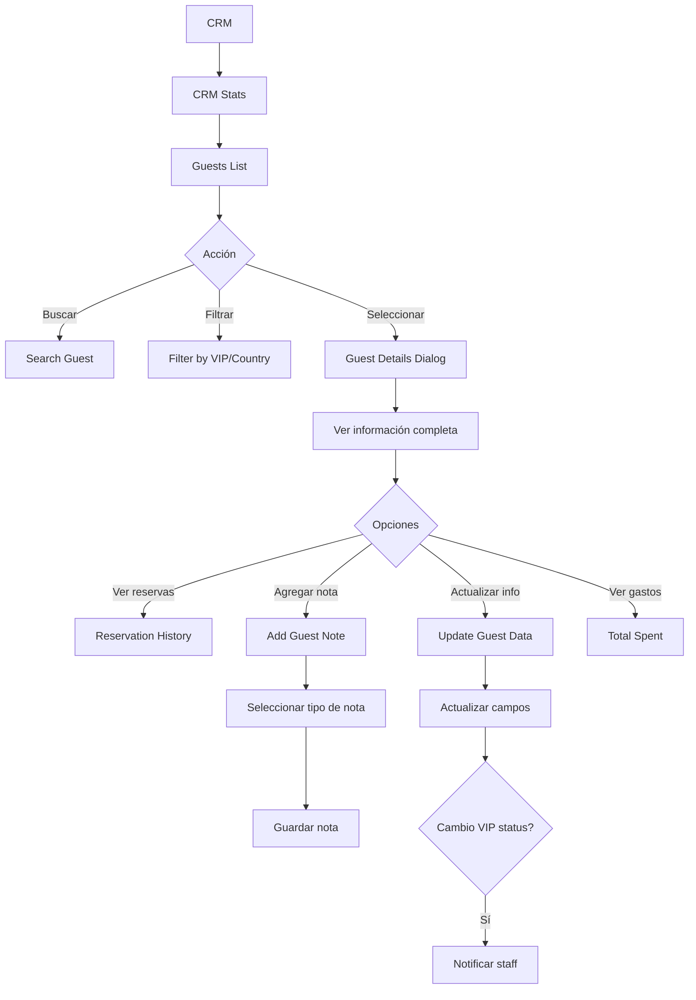
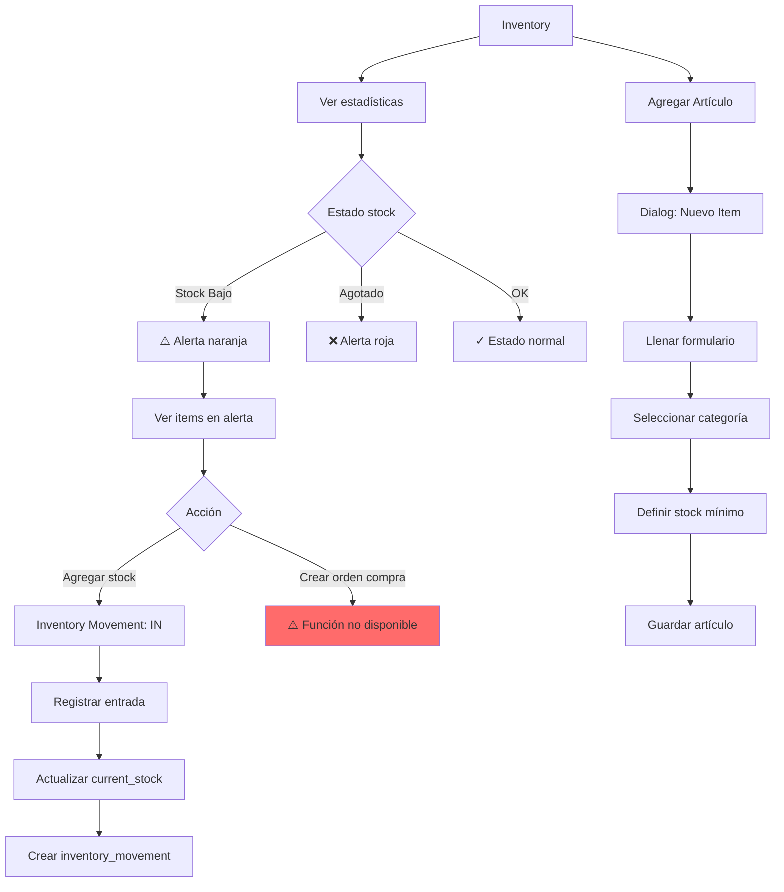
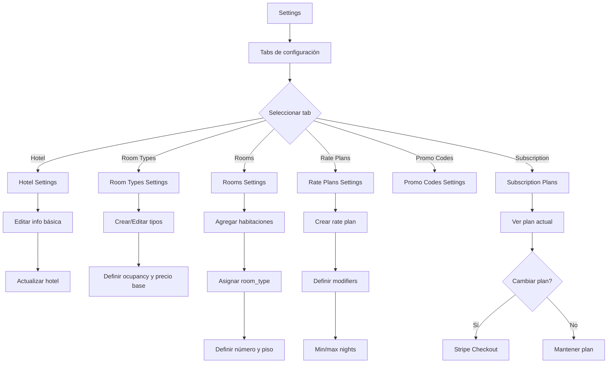

# ANALISIS COMPLETO UX/UI - HOTELMATE (SOLARIS PMS)

**Fecha:** 06 de Noviembre, 2025
**Proyecto:** HotelMate Core - Sistema de Gestión Hotelera
**Ubicación:** `/Users/marcelinofranciscomartinez/Documents/HPms/hotelmate-core`

---

## TABLA DE CONTENIDOS

1. [Resumen Ejecutivo](#1-resumen-ejecutivo)
2. [Tipos de Usuarios y Roles](#2-tipos-de-usuarios-y-roles)
3. [Arquitectura de Información](#3-arquitectura-de-informacion)
4. [User Flows por Rol](#4-user-flows-por-rol)
5. [Inventario de Páginas y Funcionalidades](#5-inventario-de-paginas-y-funcionalidades)
6. [Análisis de Navegación](#6-analisis-de-navegacion)
7. [Sistema de Permisos y Autorización](#7-sistema-de-permisos-y-autorizacion)
8. [Puntos de Fricción Identificados](#8-puntos-de-friccion-identificados)
9. [Análisis de Experiencia por Usuario](#9-analisis-de-experiencia-por-usuario)
10. [Recomendaciones de Mejora UX](#10-recomendaciones-de-mejora-ux)

---

## 1. RESUMEN EJECUTIVO

### 1.1 Descripción del Producto
**HotelMate (SOLARIS PMS)** es un sistema integral de gestión hotelera (PMS - Property Management System) que ofrece 12 módulos integrados para la operación completa de hoteles pequeños y medianos.

### 1.2 Filosofía de Diseño Actual
- **Diseño centrado en datos**: Dashboard con KPIs principales
- **Navegación por módulos**: Estructura modular clara con sidebar
- **Responsive Design**: Mobile-first con adaptación a tablets y desktop
- **Sistema de diseño**: Componentes UI consistentes basados en shadcn/ui
- **Gestión basada en roles**: Control granular de permisos

### 1.3 Tecnologías UX/UI
- **Framework**: React + TypeScript
- **Routing**: React Router v6
- **UI Components**: shadcn/ui (Radix UI primitives)
- **Styling**: Tailwind CSS con tema personalizado
- **State Management**: TanStack Query (React Query)
- **Forms**: React Hook Form + Zod validation

### 1.4 Hallazgos Clave
✅ **Fortalezas:**
- Arquitectura modular bien organizada
- Sistema de permisos robusto
- Diseño visual consistente
- Funcionalidad completa end-to-end

⚠️ **Áreas de Mejora:**
- Onboarding inexistente para nuevos usuarios
- Falta de guías contextuales
- Complejidad inicial para usuarios no técnicos
- Necesidad de tutoriales interactivos

---

## 2. TIPOS DE USUARIOS Y ROLES

### 2.1 Jerarquía de Roles

```
SUPER_ADMIN (Administrador del Sistema)
    ↓
HOTEL_OWNER (Propietario del Hotel)
    ↓
MANAGER (Gerente General)
    ↓
├── RECEPTION (Recepcionista)
├── HOUSEKEEPING (Limpieza)
├── MAINTENANCE (Mantenimiento)
├── SALES (Ventas)
└── STAFF (Personal General)
```

### 2.2 Definición de Roles

#### SUPER_ADMIN
- **Descripción**: Administrador del sistema con acceso completo
- **Permisos**: Acceso total a todos los módulos y hoteles
- **Casos de uso**: Gestión de plataforma, soporte técnico

#### HOTEL_OWNER
- **Descripción**: Propietario del hotel
- **Permisos**: Acceso completo a su hotel
- **Módulos clave**:
  - Todos los módulos
  - Configuración completa
  - Gestión de suscripciones
  - Gestión de staff

#### MANAGER
- **Descripción**: Gerente general del hotel
- **Permisos**: Amplio acceso operativo
- **Módulos clave**:
  - Dashboard
  - Reservations (crear, leer, actualizar, eliminar, exportar)
  - Front Desk (lectura)
  - CRM (completo)
  - Billing (completo)
  - Housekeeping (lectura y actualización)
  - Reports (lectura y exportación)
  - Settings (lectura y actualización)

#### RECEPTION
- **Descripción**: Personal de recepción
- **Permisos**: Gestión de huéspedes y reservas
- **Módulos clave**:
  - Reservations (crear, leer, actualizar)
  - Front Desk (completo)
  - CRM (crear, leer, actualizar)
  - Billing (crear, leer)

#### HOUSEKEEPING
- **Descripción**: Personal de limpieza
- **Permisos**: Gestión de limpieza de habitaciones
- **Módulos clave**:
  - Housekeeping (completo)
  - Rooms (lectura)
  - Tasks (relacionadas con limpieza)

#### SALES
- **Descripción**: Equipo de ventas
- **Permisos**: Gestión de reservas y clientes
- **Módulos clave**:
  - Reservations (crear, leer, actualizar)
  - CRM (crear, leer, actualizar)
  - Reports (lectura)

#### MAINTENANCE & STAFF
- **Descripción**: Personal de mantenimiento y soporte
- **Permisos**: Limitado a tareas asignadas
- **Módulos clave**:
  - Tasks (asignadas)
  - Incidents (reportar y resolver)

### 2.3 Personas de Usuario

#### Persona 1: María (Propietaria del Hotel)
- **Edad**: 45 años
- **Experiencia técnica**: Media
- **Objetivos**: Maximizar ocupación, controlar costos, monitorear personal
- **Frustraciones**: Sistemas complicados, reportes confusos
- **Necesidades**: Dashboard claro, reportes automatizados, control de ingresos

#### Persona 2: Carlos (Recepcionista)
- **Edad**: 28 años
- **Experiencia técnica**: Alta
- **Objetivos**: Check-in/out rápido, satisfacción del huésped
- **Frustraciones**: Procesos lentos, información dispersa
- **Necesidades**: Acceso rápido a reservas, asignación de habitaciones, facturación ágil

#### Persona 3: Ana (Personal de Limpieza)
- **Edad**: 35 años
- **Experiencia técnica**: Baja
- **Objetivos**: Completar tareas diarias, reportar incidencias
- **Frustraciones**: Interfaces complicadas, falta de claridad en tareas
- **Necesidades**: Lista clara de habitaciones, checklist simple, reportar problemas fácilmente

---

## 3. ARQUITECTURA DE INFORMACION

### 3.1 Estructura de Navegación Principal

```
HOTELMATE (SOLARIS PMS)
│
├── LANDING PAGE (/)
│   ├── Hero Section
│   ├── Features (8 módulos destacados)
│   ├── Statistics
│   ├── CTA (Call to Action)
│   └── Footer
│
├── AUTHENTICATION (/auth)
│   ├── Sign In
│   ├── Sign Up
│   └── Password Recovery
│
└── DASHBOARD (/dashboard)
    │
    ├── MÓDULOS PRINCIPALES
    │   ├── Dashboard Home (/)
    │   ├── Reservations (/reservations)
    │   ├── Front Desk (/front-desk)
    │   ├── Housekeeping (/housekeeping)
    │   ├── Billing (/billing)
    │   ├── Channels (/channels)
    │   ├── CRM (/crm)
    │   ├── Inventory (/inventory)
    │   ├── Tasks (/tasks)
    │   ├── Staff (/staff)
    │   ├── Analytics (/analytics)
    │   └── Reports (/reports)
    │
    └── CONFIGURACIÓN Y ADMINISTRACIÓN
        ├── Security (/security)
        ├── Settings (/settings)
        │   ├── Hotel Settings
        │   ├── Room Types
        │   ├── Rooms
        │   ├── Rate Plans
        │   ├── Promo Codes
        │   └── Subscription
        └── Profile (/profile)
```

### 3.2 Jerarquía de Componentes UI

```
LAYOUT PRINCIPAL
├── ErrorBoundary
│   └── QueryClientProvider
│       └── TooltipProvider
│           └── BrowserRouter
│               └── Routes
│                   ├── Index (Landing)
│                   ├── Auth
│                   └── Dashboard
│                       ├── SidebarProvider
│                       │   ├── AppSidebar
│                       │   │   ├── Header (Logo)
│                       │   │   ├── SidebarContent
│                       │   │   │   ├── Módulos Principales
│                       │   │   │   └── Sistema
│                       │   │   └── SidebarFooter (User)
│                       │   │
│                       │   └── Main Content
│                       │       ├── Header (Hotel Info + User Menu)
│                       │       │   ├── SidebarTrigger
│                       │       │   ├── Hotel Name/Location
│                       │       │   ├── NotificationBell
│                       │       │   └── User Dropdown
│                       │       │
│                       │       └── Page Content (Outlet)
│                       │
│                       └── Modals/Dialogs/Toasts
```

### 3.3 Categorización de Módulos

#### OPERACIONES (Operations)
- **Front Desk**: Check-in/out, asignación de habitaciones
- **Housekeeping**: Limpieza y mantenimiento
- **Tasks**: Gestión de tareas operativas

#### VENTAS & MARKETING (Sales & Marketing)
- **Reservations**: Gestión de reservas
- **Channels**: Distribución y OTAs
- **CRM**: Gestión de clientes
- **Revenue Management**: Pricing dinámico (integrado en Dashboard)

#### FINANZAS (Finance)
- **Billing**: Facturación y pagos
- **Reports**: Reportes financieros
- **Analytics**: Métricas de negocio

#### ADMINISTRACIÓN (Administration)
- **Staff**: Gestión de personal
- **Inventory**: Control de suministros
- **Settings**: Configuración del hotel
- **Security**: Seguridad y permisos

### 3.4 Mapa de Base de Datos (Entidades Principales)

```
CORE ENTITIES
├── hotels
├── rooms
├── room_types
└── rate_plans

USER MANAGEMENT
├── profiles (auth.users)
├── user_roles
├── permissions
├── role_permissions
└── user_permissions

RESERVATIONS & GUESTS
├── reservations
├── guests
├── guest_notes
├── folios
├── folio_charges
└── inventory_by_day

OPERATIONS
├── room_locks
├── cleaning_checklists
├── tasks
├── incidents
├── incident_history
└── materials

CRM & CHANNELS
├── channel_connections
├── user_consents
└── notifications

COMPLIANCE & AUDIT
├── audit_logs
├── data_access_logs
├── data_requests
└── data_retention_policies

STAFF
└── staff_invitations
```

### 3.5 Sistema de Etiquetado y Nomenclatura

#### Convenciones de Nombres
- **Rutas**: kebab-case (`/front-desk`, `/room-types`)
- **Componentes**: PascalCase (`DashboardHome`, `ReservationsList`)
- **Funciones**: camelCase (`handleCheckIn`, `createReservation`)
- **Variables de estado**: camelCase (`selectedGuest`, `isLoading`)
- **Constantes**: UPPER_SNAKE_CASE (`RESERVATION_STATUS`, `ROOM_STATUS`)

#### Términos de Dominio Consistentes
- **Reservation** (no Booking)
- **Guest** (no Customer en contexto de hospedaje)
- **Room** (habitación física)
- **Room Type** (tipo de habitación)
- **Rate Plan** (plan de tarifas)
- **Folio** (cuenta del huésped)
- **Check-in** / **Check-out** (con guión)

---

## 4. USER FLOWS POR ROL

### 4.1 FLUJO: Onboarding de Nuevo Usuario

```mermaid
flowchart TD
    A[Landing Page] -->|Click "Comenzar Gratis"| B[Auth Page - Sign Up Tab]
    B --> C[Llenar Formulario]
    C --> D{Validación}
    D -->|Error| C
    D -->|Success| E[Cuenta Creada]
    E --> F[Redirect a /auth]
    F --> G[Sign In]
    G --> H{Tiene hotel asignado?}
    H -->|No| I[Sin acceso - Contactar admin]
    H -->|Sí| J[Dashboard]
    J --> K[¿Primera vez?]
    K -->|Sí| L[⚠️ NO HAY ONBOARDING]
    K -->|No| M[Dashboard Home]

    style L fill:#ff6b6b
```

**PUNTO DE FRICCION CRÍTICO**: No existe un flujo de onboarding para nuevos usuarios.

### 4.2 FLUJO: Proceso de Reserva Completo

#### 4.2.1 Crear Nueva Reserva (RECEPTION)

```mermaid
flowchart TD
    A[Dashboard] --> B[Click Reservations]
    B --> C[Click "Nueva Reserva"]
    C --> D[Dialog: Formulario de Reserva]
    D --> E[Seleccionar fechas]
    E --> F[Seleccionar tipo de habitación]
    F --> G[Ingresar datos del huésped]
    G --> H[Calcular precio]
    H --> I[Confirmar reserva]
    I --> J{Validación de inventario}
    J -->|No disponible| K[Error - Sin inventario]
    J -->|Disponible| L[Crear reserva]
    L --> M{Estado}
    M -->|PENDING_PAYMENT| N[Esperar pago]
    M -->|CONFIRMED| O[Reserva confirmada]
    O --> P[Actualizar inventario]
    P --> Q[Crear folio]
    Q --> R[Enviar confirmación email]

    style K fill:#ff6b6b
    style O fill:#51cf66
```

#### 4.2.2 Gestionar Reserva Existente



### 4.3 FLUJO: Check-in / Check-out (RECEPTION)

#### 4.3.1 Check-in



#### 4.3.2 Check-out



### 4.4 FLUJO: Limpieza de Habitaciones (HOUSEKEEPING)



### 4.5 FLUJO: Gestión de Pagos (RECEPTION/MANAGER)



### 4.6 FLUJO: Gestión de Staff (HOTEL_OWNER/MANAGER)

```mermaid
flowchart TD
    A[Staff] --> B{Acción}
    B -->|Agregar| C[Click "Agregar Personal"]
    B -->|Ver| D[Staff List]

    C --> E[Add Staff Dialog]
    E --> F[Ingresar email y datos]
    F --> G[Seleccionar rol]
    G --> H[Enviar invitación]
    H --> I[Crear staff_invitation]
    I --> J[Email enviado]
    J --> K[Esperar aceptación]

    K --> L{Usuario acepta?}
    L -->|Sí| M[Crear user_role]
    L -->|No| N[Invitación vencida]

    M --> O[Usuario tiene acceso]

    D --> P[Filtrar por rol]
    D --> Q[Ver detalles]
```

### 4.7 FLUJO: Revenue Management (MANAGER/OWNER)



### 4.8 FLUJO: CRM - Gestión de Huéspedes



### 4.9 FLUJO: Inventario & Suministros (MANAGER)



### 4.10 FLUJO: Configuración del Hotel (OWNER)



---

## 5. INVENTARIO DE PAGINAS Y FUNCIONALIDADES

### 5.1 Páginas Públicas

| Ruta | Archivo | Componentes Clave | Funcionalidad |
|------|---------|-------------------|---------------|
| `/` | `Index.tsx` | Hero, Features, Stats, CTA | Landing page marketing |
| `/auth` | `Auth.tsx` | SignIn, SignUp, PasswordReset | Autenticación |

### 5.2 Dashboard - Páginas Principales

| Ruta | Archivo | Componentes Principales | Funcionalidad Principal |
|------|---------|------------------------|------------------------|
| `/dashboard` | `DashboardHome.tsx` | KPI Cards, Revenue Chart, Tasks, Guests List | Panel de control general |
| `/dashboard/reservations` | `Reservations.tsx` | Timeline, List, Calendar, Filters | Gestión completa de reservas |
| `/dashboard/front-desk` | `FrontDesk.tsx` | Arrivals, Departures, InHouse, RoomStatus | Check-in/out y asignación |
| `/dashboard/housekeeping` | `Housekeeping.tsx` | DailyStats, CleaningPriority, Checklist | Gestión de limpieza |
| `/dashboard/billing` | `Billing.tsx` | BillingStats, ActiveFolios, FolioDetails | Facturación y pagos |
| `/dashboard/channels` | `Channels.tsx` | ChannelConnections, Sync | Distribución OTAs |
| `/dashboard/crm` | `CRM.tsx` | GuestsList, GuestDetails, Stats | CRM y fidelización |
| `/dashboard/inventory` | `Inventory.tsx` | ItemsList, Stats, Movement | Control de suministros |
| `/dashboard/tasks` | `Tasks.tsx` | TasksList, CreateTask, Assignment | Gestión de tareas |
| `/dashboard/staff` | `Staff.tsx` | StaffList, Invitations, Roles | Gestión de personal |
| `/dashboard/analytics` | `Analytics.tsx` | Charts, Metrics, Insights | Analytics y reportes |
| `/dashboard/reports` | `Reports.tsx` | ReportTemplates, Export | Generación de reportes |
| `/dashboard/security` | `Security.tsx` | AuditLogs, Permissions | Seguridad y auditoría |
| `/dashboard/settings` | `Settings.tsx` | Tabs (6 categorías) | Configuración completa |
| `/dashboard/profile` | `Profile.tsx` | UserInfo, Preferences | Perfil de usuario |

### 5.3 Componentes Reutilizables Críticos

#### Navegación
- `AppSidebar.tsx` - Navegación principal con permisos
- `NotificationBell.tsx` - Sistema de notificaciones
- `PermissionGuard.tsx` - Control de acceso a componentes

#### Reservations
- `ReservationsList.tsx`
- `ReservationsCalendar.tsx`
- `ReservationsTimeline.tsx`
- `NewReservationDialog.tsx`
- `ReservationFilters.tsx`

#### Front Desk
- `TodayArrivals.tsx`
- `TodayDepartures.tsx`
- `InHouseGuests.tsx`
- `RoomStatusGrid.tsx`
- `WalkInDialog.tsx`

#### Housekeeping
- `DailyStats.tsx`
- `RoomsByStatus.tsx`
- `CleaningPriority.tsx`
- `RoomChecklist.tsx`
- `IncidentReports.tsx`

#### CRM
- `GuestsList.tsx`
- `GuestDetails.tsx`
- `CRMStats.tsx`

#### Billing
- `ActiveFolios.tsx`
- `FolioDetails.tsx`
- `BillingStats.tsx`
- `RecentTransactions.tsx`

#### Settings
- `HotelSettings.tsx`
- `RoomTypesSettings.tsx`
- `RoomsSettings.tsx`
- `RatePlansSettings.tsx`
- `PromoCodesSettings.tsx`
- `SubscriptionPlans.tsx`

#### Staff
- `AddStaffDialog.tsx`

#### Inventory
- `InventoryMovementDialog.tsx`

### 5.4 Funciones Backend (Supabase Edge Functions)

| Función | Propósito | Usuario |
|---------|-----------|---------|
| `check-in` | Procesar check-in | RECEPTION |
| `check-out` | Procesar check-out | RECEPTION |
| `confirm-reservation-payment` | Confirmar pago de reserva | SYSTEM |
| `create-customer-portal` | Portal de cliente Stripe | OWNER |
| `create-payment-intent` | Crear intención de pago | RECEPTION |
| `create-reservation` | Crear nueva reserva | RECEPTION/SALES |
| `create-subscription-checkout` | Checkout de suscripción | OWNER |
| `ensure-subscription` | Verificar suscripción activa | SYSTEM |
| `get-payment-history` | Historial de pagos | MANAGER |
| `get-payment-method` | Obtener método de pago | RECEPTION |
| `reset-subscription` | Resetear suscripción | OWNER |
| `send-email` | Enviar correos | SYSTEM |
| `send-reservation-confirmation` | Confirmación de reserva | SYSTEM |
| `send-staff-invitation` | Invitación a staff | OWNER/MANAGER |

---

## 6. ANALISIS DE NAVEGACION

### 6.1 Patrones de Navegación

#### Navegación Principal (Sidebar)
**Estructura:**
```
[Logo] SOLARIS PMS
├── MÓDULOS
│   ├── Dashboard
│   ├── Reservas
│   ├── Front Desk
│   ├── Housekeeping
│   ├── Facturación
│   ├── Channel Manager
│   ├── CRM
│   ├── Inventario
│   ├── Tareas
│   ├── Staff
│   ├── Analytics
│   └── Reportes
└── SISTEMA
    ├── Seguridad
    └── Configuración

[User Avatar] Usuario
```

**Características:**
- Collapsible (icon mode)
- Filtrado por permisos
- Active state highlighting
- Iconos con código de color
- Sticky positioning

#### Navegación Secundaria (Header)
```
[☰ Sidebar Toggle] | [Hotel Name, City] | [🔔 Notifications] [👤 User Menu]
```

#### Navegación Terciaria (Tabs)
Usado en:
- Reservations (Timeline | List | Calendar)
- Settings (6 tabs)
- Staff (All | Management | Operations)

### 6.2 Breadcrumbs
**Estado actual**: NO IMPLEMENTADO

**Recomendación**: Implementar para módulos con múltiples niveles
```
Dashboard > Reservations > Reservation Details > Edit
```

### 6.3 Búsqueda y Filtrado

#### Reservations
- Search por nombre/email
- Filter por status
- Filter por room type
- Date range selection

#### CRM
- Search por nombre
- Filter por VIP status
- Filter por país
- Sort por gastos/estadías

#### Inventory
- Search por nombre
- Filter por categoría
- Filter por stock status

#### Staff
- Filter por rol (tabs)
- Search (no implementado)

### 6.4 Métricas de Navegación

| Métrica | Valor Actual | Objetivo | Estado |
|---------|--------------|----------|--------|
| Clics hasta reserva | 2-3 | <3 | ✅ Bueno |
| Clics hasta check-in | 3-4 | <3 | ⚠️ Mejorable |
| Tiempo de carga inicial | <2s | <3s | ✅ Bueno |
| Módulos visibles sin scroll | 11/12 | 100% | ✅ Bueno |

### 6.5 Análisis de Profundidad

```
Nivel 1: Landing / Auth
    ↓
Nivel 2: Dashboard Layout
    ↓
Nivel 3: Módulo específico (ej: Reservations)
    ↓
Nivel 4: Vista específica (ej: List view)
    ↓
Nivel 5: Detalle (ej: Reservation Details Dialog)
    ↓
Nivel 6: Acción (ej: Edit Form)
```

**Profundidad máxima**: 6 niveles
**Profundidad promedio**: 4 niveles
**Evaluación**: Aceptable, pero podría simplificarse

---

## 7. SISTEMA DE PERMISOS Y AUTORIZACION

### 7.1 Implementación de Permisos

**Hook principal**: `/src/hooks/usePermissions.ts`

```typescript
export function usePermissions(hotelId?: string) {
  const { data: userRole, isLoading } = useQuery({
    queryKey: ["user-role", hotelId],
    // ... query implementation
  });

  const hasPermission = (module: string, action: string, resource?: string): boolean => {
    // Permission logic
  };

  const canAccessModule = (moduleName: string): boolean => {
    return hasPermission(moduleName, "read");
  };

  return {
    userRole,
    isLoading,
    hasPermission,
    canAccessModule,
    isAdmin,
    isManager,
    isReception,
    isHousekeeping,
    isSales,
  };
}
```

### 7.2 Matriz de Permisos por Rol

#### Leyenda
- C = Create (Crear)
- R = Read (Leer)
- U = Update (Actualizar)
- D = Delete (Eliminar)
- E = Export (Exportar)

| Módulo | SUPER_ADMIN | HOTEL_OWNER | MANAGER | RECEPTION | HOUSEKEEPING | SALES | MAINTENANCE |
|--------|-------------|-------------|---------|-----------|--------------|-------|-------------|
| **Dashboard** | CRUDE | CRUDE | CRUDE | R | R | R | R |
| **Reservations** | CRUDE | CRUDE | CRUDE | CRU | - | CRU | - |
| **Front Desk** | CRUDE | CRUDE | R | CRUD | - | - | - |
| **Housekeeping** | CRUDE | CRUDE | RU | - | CRUD | - | R |
| **Billing** | CRUDE | CRUDE | CRUDE | CR | - | - | - |
| **Channels** | CRUDE | CRUDE | CRUD | - | - | - | - |
| **CRM** | CRUDE | CRUDE | CRUDE | CRU | - | CRU | - |
| **Inventory** | CRUDE | CRUDE | CRUD | - | R | - | R |
| **Tasks** | CRUDE | CRUDE | CRUD | R | RU | - | RU |
| **Staff** | CRUDE | CRUDE | CRUD | - | - | - | - |
| **Analytics** | CRUDE | CRUDE | RE | - | - | R | - |
| **Reports** | CRUDE | CRUDE | RE | - | - | R | - |
| **Security** | CRUDE | CRUDE | R | - | - | - | - |
| **Settings** | CRUDE | CRUDE | RU | - | - | - | - |

### 7.3 Componente PermissionGuard

**Ubicación**: `/src/components/auth/PermissionGuard.tsx`

**Uso**:
```tsx
<PermissionGuard module="front-desk" action="create" hotelId={hotelId}>
  <WalkInDialog hotelId={hotelId} />
</PermissionGuard>
```

**Comportamiento**:
- Renderiza children solo si tiene permiso
- Retorna null si no tiene permiso
- No muestra mensajes de error al usuario (silent fail)

### 7.4 Seguridad en Base de Datos

**Row Level Security (RLS)** implementado en todas las tablas:
- Usuarios solo acceden a datos de su hotel
- Verificación de permisos a nivel de base de datos
- Funciones PostgreSQL para validación:
  - `has_hotel_access(hotel_id, user_id)`
  - `has_hotel_role(hotel_id, user_id, role)`
  - `has_permission(module, action, hotel_id, user_id)`

### 7.5 Auditoría y Logs

**Tabla**: `audit_logs`

Registra:
- Acción realizada
- Usuario
- Hotel
- Timestamp
- Valores anteriores y nuevos (JSON)
- IP address
- User agent
- Éxito/error

**Tabla**: `data_access_logs`

Registra acceso a datos sensibles (GDPR compliance):
- Tipo de dato
- Campos accedidos
- Propósito del acceso
- Base legal
- Usuario que accedió

---

## 8. PUNTOS DE FRICCION IDENTIFICADOS

### 8.1 Críticos (Bloquean flujo principal)

#### 1. Ausencia de Onboarding
**Severidad**: 🔴 Alta
**Usuario afectado**: Todos los nuevos usuarios
**Problema**:
- No hay tutorial inicial
- No hay tooltips explicativos
- Usuarios se sienten perdidos al primer ingreso

**Impacto**:
- Curva de aprendizaje empinada
- Posible abandono de usuarios
- Aumento en solicitudes de soporte

**Solución recomendada**:
1. Tour guiado interactivo (ej: Intro.js, Shepherd.js)
2. Tooltips contextuales
3. Video tutorial embebido
4. Checklist de primeros pasos

---

#### 2. Sin Hotel Asignado - Dead End
**Severidad**: 🔴 Alta
**Usuario afectado**: Usuarios sin rol asignado
**Problema**:
```
Usuario crea cuenta → Login → No hotel asignado → Pantalla de error → Sin CTA
```

**Solución recomendada**:
1. Flujo de creación de hotel para HOTEL_OWNER
2. Formulario de solicitud de acceso
3. Información de contacto de soporte
4. Opción de crear hotel demo

---

#### 3. Proceso de Check-in No Optimizado
**Severidad**: 🟠 Media-Alta
**Usuario afectado**: RECEPTION
**Problema**:
- Múltiples clics entre módulos (Reservations → Front Desk)
- No hay asignación automática de habitación
- Falta verificación de documentos integrada

**Solución recomendada**:
1. Quick check-in desde Reservations
2. Auto-asignación inteligente de habitaciones
3. Checklist de verificación en un solo paso

---

### 8.2 Moderados (Afectan eficiencia)

#### 4. Búsqueda Global Ausente
**Severidad**: 🟠 Media
**Usuario afectado**: Todos
**Problema**:
- No hay búsqueda global (CMD+K o Ctrl+K)
- Búsqueda limitada a cada módulo
- No se pueden buscar huéspedes desde cualquier lugar

**Solución recomendada**:
1. Implementar Command Palette (CMD+K)
2. Búsqueda global de huéspedes, reservas, habitaciones
3. Atajos de teclado para acciones comunes

---

#### 5. Sin Modo Offline
**Severidad**: 🟡 Media
**Usuario afectado**: RECEPTION, HOUSEKEEPING
**Problema**:
- Sin conexión = sistema inaccesible
- Hoteles en zonas con internet inestable sufren

**Solución recomendada**:
1. Service Worker para cache
2. Queue de acciones offline
3. Sync cuando vuelve conexión

---

#### 6. Navegación en Mobile Limitada
**Severidad**: 🟡 Media
**Usuario afectado**: Staff en movimiento
**Problema**:
- Sidebar oculta en mobile
- Header ocupa mucho espacio
- Tabs horizontales difíciles en pantallas pequeñas

**Solución recomendada**:
1. Bottom navigation bar en mobile
2. Swipe gestures entre vistas
3. Floating action button para acciones principales

---

### 8.3 Menores (Mejoras de usabilidad)

#### 7. Sin Bulk Actions
**Severidad**: 🟢 Baja
**Usuario afectado**: MANAGER
**Problema**:
- No se pueden seleccionar múltiples reservas
- No hay exportación masiva
- Actualización de tarifas de una en una

**Solución recomendada**:
1. Checkboxes para selección múltiple
2. Acciones en batch (exportar, cancelar, cambiar estado)

---

#### 8. Notificaciones No Persistentes
**Severidad**: 🟢 Baja
**Usuario afectado**: Todos
**Problema**:
- Notificaciones desaparecen rápido
- No hay historial de notificaciones
- No se pueden marcar como leídas

**Solución recomendada**:
1. Drawer de notificaciones con historial
2. Marcar como leído/no leído
3. Filtros por tipo de notificación

---

#### 9. Sin Atajos de Teclado
**Severidad**: 🟢 Baja
**Usuario afectado**: Power users
**Problema**:
- Todo requiere mouse/touch
- Usuarios avanzados no pueden optimizar flujo

**Solución recomendada**:
1. Keyboard shortcuts (N = Nueva reserva, G+R = Ir a Reservations)
2. Help modal con lista de shortcuts
3. Customización de shortcuts

---

### 8.4 Mapa de Calor de Fricción

```
ALTA FRICCIÓN (🔴)
├── Onboarding
├── Usuario sin hotel
└── Check-in multi-paso

MEDIA FRICCIÓN (🟠🟡)
├── Sin búsqueda global
├── Sin modo offline
└── Mobile navigation

BAJA FRICCIÓN (🟢)
├── Sin bulk actions
├── Notificaciones efímeras
└── Sin keyboard shortcuts
```

---

## 9. ANALISIS DE EXPERIENCIA POR USUARIO

### 9.1 HOTEL_OWNER - María (Propietaria)

#### Journey Map

```
FASE 1: DESCUBRIMIENTO
😊 Encuentra landing page
😊 Ve características completas
😊 Registro fácil

FASE 2: SETUP INICIAL
😐 No hay onboarding → FRICCIÓN
😊 Configura hotel en Settings
😐 Necesita ayuda para room types

FASE 3: OPERACIÓN DIARIA
😊 Dashboard claro con KPIs
😊 Revenue Management útil
😐 Necesita más reportes customizables

FASE 4: GESTIÓN DE PERSONAL
😊 Invitación de staff simple
😐 No hay control de horarios/turnos
😐 Sin evaluaciones de desempeño
```

**Puntos de dolor**:
1. Falta de onboarding estructurado
2. Curva de aprendizaje inicial alta
3. Gestión de staff limitada a roles

**Oportunidades de mejora**:
1. Video tutorial "Primeros pasos como propietario"
2. Templates de configuración (boutique, resort, etc.)
3. Dashboard customizable

**Experiencia general**: 7/10

---

### 9.2 RECEPTION - Carlos (Recepcionista)

#### Journey Map

```
FASE 1: CHECK-IN MATUTINO
😊 Today Arrivals clara
😐 Asignación manual de habitación
😐 Switch entre módulos

FASE 2: WALK-IN
😊 Walk-in dialog rápido
😊 Disponibilidad en tiempo real
😐 Proceso de pago separado

FASE 3: ATENCIÓN AL HUÉSPED
😊 CRM con historial completo
😐 Sin acceso rápido desde otras vistas
😐 No puede enviar mensajes directos

FASE 4: CHECK-OUT VESPERTINO
😊 Today Departures organizada
😊 Folio detallado
😐 Proceso multi-paso
```

**Puntos de dolor**:
1. Check-in requiere múltiples pasos
2. No hay quick actions
3. Switch constante entre módulos

**Oportunidades de mejora**:
1. Quick check-in en un solo paso
2. Asignación automática de habitaciones
3. Acciones rápidas en notificaciones

**Experiencia general**: 8/10

---

### 9.3 HOUSEKEEPING - Ana (Personal de Limpieza)

#### Journey Map

```
FASE 1: INICIO DE TURNO
😊 Dashboard simple y claro
😊 Cleaning Priority visible
😐 Demasiada información técnica

FASE 2: LIMPIEZA DE HABITACIONES
😊 Checklist clara
😊 Marcar items fácil
😐 Requiere varios clics

FASE 3: REPORTE DE INCIDENCIAS
😐 Formulario complejo
😐 Términos técnicos confusos
😊 Notificación a mantenimiento automática

FASE 4: FIN DE TURNO
😊 Ver progreso del día
😐 No hay resumen de tareas completadas
```

**Puntos de dolor**:
1. Interface demasiado técnica para usuarios no-tech
2. Checklist podría ser más visual
3. Reporte de incidencias complejo

**Oportunidades de mejora**:
1. Interface simplificada con iconos grandes
2. Checklist visual con fotos
3. Reporte de incidencias con voz/foto

**Experiencia general**: 6/10

---

### 9.4 MANAGER - Gerente General

#### Journey Map

```
FASE 1: REVISIÓN MATUTINA
😊 Dashboard completo
😊 KPIs claros y accionables
😊 Revenue management integrado

FASE 2: TOMA DE DECISIONES
😊 Analytics detallado
😐 Exportación de reportes limitada
😐 Sin predicciones/forecasting

FASE 3: GESTIÓN DE EQUIPO
😊 Vista clara de staff
😐 No hay métricas de performance
😐 Sin sistema de evaluaciones

FASE 4: OPERACIÓN DIARIA
😊 Acceso a todos los módulos
😊 Permisos bien configurados
😐 Demasiados módulos para navegar
```

**Puntos de dolor**:
1. Falta de forecasting y predicciones
2. Reportes limitados
3. No hay métricas de staff

**Oportunidades de mejora**:
1. Reportes customizables
2. Predicciones con IA
3. Dashboard de performance de staff

**Experiencia general**: 8/10

---

### 9.5 Tabla Comparativa de Satisfacción

| Aspecto | OWNER | MANAGER | RECEPTION | HOUSEKEEPING | SALES |
|---------|-------|---------|-----------|--------------|-------|
| **Onboarding** | 4/10 | 5/10 | 6/10 | 3/10 | 5/10 |
| **UI Clarity** | 8/10 | 9/10 | 8/10 | 6/10 | 7/10 |
| **Efficiency** | 7/10 | 8/10 | 7/10 | 6/10 | 7/10 |
| **Features** | 9/10 | 8/10 | 8/10 | 7/10 | 7/10 |
| **Mobile** | 6/10 | 6/10 | 7/10 | 5/10 | 6/10 |
| **OVERALL** | **7/10** | **8/10** | **8/10** | **6/10** | **7/10** |

---

## 10. RECOMENDACIONES DE MEJORA UX

### 10.1 PRIORIDAD ALTA (Implementar en 1-2 sprints)

#### 1. Sistema de Onboarding Completo

**Objetivo**: Reducir curva de aprendizaje en 60%

**Componentes**:

1. **Welcome Tour** (First-time users)
   ```
   Paso 1: Bienvenida a SOLARIS PMS
   Paso 2: Tour del Dashboard
   Paso 3: Cómo crear una reserva
   Paso 4: Gestión de habitaciones
   Paso 5: Configuración inicial
   ```

2. **Contextual Tooltips**
   - Iconos de ayuda (?) junto a features complejas
   - Activar con hover o click
   - Ejemplos visuales

3. **Video Tutorials**
   - Embebido en cada módulo principal
   - Librería de videos en Settings
   - Categorías: Básico, Intermedio, Avanzado

4. **Checklist de Setup**
   ```
   ☐ Configurar información del hotel
   ☐ Crear tipos de habitación
   ☐ Agregar habitaciones
   ☐ Configurar tarifas
   ☐ Invitar staff
   ☐ Crear primera reserva
   ```

**Herramientas sugeridas**:
- Shepherd.js o Intro.js para tours
- Tippy.js para tooltips
- Loom o Vimeo para videos

**Métricas de éxito**:
- Time to first reservation < 10 min
- Support tickets reducidos en 40%
- User satisfaction > 8/10

---

#### 2. Quick Actions & Command Palette

**Objetivo**: Reducir clics en 30%

**Features**:

1. **Command Palette (CMD+K / Ctrl+K)**
   ```
   Search for...
   > Nueva reserva
   > Check-in huésped
   > Buscar huésped: Juan
   > Ir a Housekeeping
   > Agregar tarea
   ```

2. **Floating Action Button (Mobile)**
   - Botón "+" en esquina inferior derecha
   - Menu radial con acciones principales:
     - Nueva reserva
     - Check-in
     - Agregar tarea

3. **Quick Actions Cards**
   - En Dashboard Home
   - Acciones directas sin navegar:
     ```
     [Quick Check-in] [Nueva Reserva] [Ver Llegadas Hoy]
     ```

**Implementación**:
- kbar o cmdk para command palette
- React Spring para animaciones

---

#### 3. Optimización del Flujo de Check-in

**Objetivo**: Check-in en <2 minutos

**Nuevo flujo**:

```
1. IDENTIFICACIÓN
   [Buscar reserva] → Auto-complete

2. ASIGNACIÓN AUTOMÁTICA
   Algoritmo selecciona mejor habitación:
   - Matching room type
   - Mismo piso si grupo
   - Preferencias del huésped (si existen)

3. VERIFICACIÓN (Single Screen)
   ☐ Documento verificado
   ☐ Forma de pago registrada
   ☐ Términos aceptados

4. CONFIRMACIÓN
   → Habitación asignada
   → Email de bienvenida
   → Notificación a housekeeping
```

**Beneficios**:
- Reducción de 5 pasos a 3
- Asignación inteligente
- Experiencia unificada

---

### 10.2 PRIORIDAD MEDIA (Implementar en 2-4 sprints)

#### 4. Sistema de Notificaciones Mejorado

**Components**:

1. **Notification Center**
   ```
   [🔔] → Drawer lateral

   📋 TAREAS (3)
   ├── Limpieza hab. 301 - Urgente
   ├── Revisar minibar hab. 205
   └── Reparar AC hab. 410

   👤 HUÉSPEDES (2)
   ├── Check-in: Juan Pérez - 2:00 PM
   └── Solicitud late check-out: María G.

   💰 PAGOS (1)
   └── Pago pendiente: Reserva #1234
   ```

2. **Real-time Updates**
   - WebSocket para actualizaciones en vivo
   - Badge con contador
   - Sonido configurable

3. **Action Buttons**
   - "Marcar como leído"
   - "Ir a detalles"
   - "Resolver"

---

#### 5. Mobile-First Redesign

**Cambios**:

1. **Bottom Navigation** (Mobile)
   ```
   [🏠 Home] [📅 Reservas] [🔔] [👤 Más]
   ```

2. **Swipe Gestures**
   - Swipe left/right entre tabs
   - Pull-to-refresh

3. **Simplified Header**
   - Reducir altura
   - Icons only en mobile

4. **Card-Based Layout**
   - Toda la información en cards
   - Fácil scroll vertical

---

#### 6. Búsqueda Global & Filtros Avanzados

**Global Search**:
```
[🔍 Buscar en todo el sistema...]

Resultados:
HUÉSPEDES
├── Juan Pérez - Reserva #1234
└── María García - VIP

HABITACIONES
└── 301 - Disponible

RESERVAS
├── Reserva #1234 - Check-in hoy
└── Reserva #1235 - Próxima semana
```

**Filtros Avanzados** (Reservations):
```
📅 Fechas: [Hoy] [Esta semana] [Este mes] [Custom]
🏷️ Estado: [Todas] [Confirmadas] [Pendientes] [Canceladas]
🛏️ Tipo: [Todos] [Standard] [Deluxe] [Suite]
💰 Monto: [$0 - $500] [$500 - $1000] [>$1000]
👤 Huéspedes: [1-2] [3-4] [5+]

[Guardar filtro] [Limpiar]
```

---

### 10.3 PRIORIDAD BAJA (Nice to have)

#### 7. Dark Mode

**Implementation**:
- next-themes para toggle
- Paleta de colores oscuros
- Persistir preferencia

#### 8. Customizable Dashboard

**Features**:
- Drag & drop widgets
- Mostrar/ocultar KPIs
- Guardar layouts por usuario

#### 9. AI-Powered Features

**Ideas**:
1. **Smart Pricing**
   - Sugerencias automáticas de tarifas
   - Basado en ocupación, eventos, competencia

2. **Predictive Maintenance**
   - Predecir cuando una habitación necesita mantenimiento
   - Basado en historial

3. **Guest Sentiment Analysis**
   - Análisis de reviews y feedback
   - Alertas de insatisfacción

#### 10. Offline Mode

**Features**:
- Service Worker
- IndexedDB para cache
- Sync queue cuando vuelve conexión

---

### 10.4 Mejoras de Accesibilidad (WCAG 2.1 AA)

#### Implementar:

1. **Keyboard Navigation**
   - Tab order lógico
   - Skip to main content
   - Shortcuts visibles

2. **Screen Reader Support**
   - ARIA labels
   - Semantic HTML
   - Alt text en imágenes

3. **Color Contrast**
   - Ratio mínimo 4.5:1
   - No depender solo de color

4. **Focus Indicators**
   - Outline visible
   - Custom focus styles

5. **Resizable Text**
   - Hasta 200% sin overflow
   - Relative units (rem)

---

### 10.5 Roadmap de Implementación

```
Q1 2025
├── ✅ Onboarding System
├── ✅ Command Palette
└── ✅ Check-in Optimization

Q2 2025
├── ⏳ Notification Center
├── ⏳ Mobile Redesign
└── ⏳ Global Search

Q3 2025
├── 📋 Dark Mode
├── 📋 Customizable Dashboard
└── 📋 Accessibility Audit

Q4 2025
├── 💡 AI Features (Phase 1)
├── 💡 Offline Mode
└── 💡 Advanced Analytics
```

---

## CONCLUSIONES Y PRÓXIMOS PASOS

### Fortalezas del Sistema Actual

1. **Arquitectura Sólida**: Modular, escalable, bien organizada
2. **Funcionalidad Completa**: Cubre todos los aspectos de gestión hotelera
3. **Sistema de Permisos Robusto**: Control granular por rol
4. **Diseño Visual Consistente**: UI components reutilizables
5. **Tecnologías Modernas**: React, TypeScript, Tailwind, Supabase

### Áreas Críticas de Mejora

1. **Onboarding** → Prioridad #1
2. **Optimización de Flujos** → Check-in, Búsqueda
3. **Mobile Experience** → Rediseño necesario
4. **Notificaciones** → Sistema más robusto
5. **Accesibilidad** → Cumplir WCAG

### Métricas de Éxito (KPIs)

| Métrica | Actual | Objetivo 6 meses |
|---------|--------|------------------|
| Time to First Reservation | 15 min | <5 min |
| Check-in Time | 5 min | <2 min |
| User Satisfaction (NPS) | N/A | >8/10 |
| Support Tickets | N/A | -50% |
| Mobile Usage | 20% | 40% |
| Feature Adoption | 60% | 85% |

### Próximos Pasos Inmediatos

**Semana 1-2:**
1. Crear prototipo de onboarding en Figma
2. User testing con 5 usuarios nuevos
3. Definir métricas de tracking

**Semana 3-4:**
1. Implementar onboarding básico
2. A/B testing con usuarios reales
3. Iterar basado en feedback

**Mes 2:**
1. Command palette implementation
2. Check-in flow optimization
3. Mobile audit completo

---

**Documento creado por**: UX/UI Analyst
**Fecha**: 06 Noviembre 2025
**Versión**: 1.0
**Próxima revisión**: Enero 2025

---

## ANEXOS

### Anexo A: User Flow Diagrams (Mermaid)
Ver secciones 4.1 - 4.10

### Anexo B: Database Schema
Ver archivo: `/src/integrations/supabase/types.ts`

### Anexo C: Component Inventory
Ver sección 5.3

### Anexo D: Permission Matrix
Ver sección 7.2

### Anexo E: Wireframes
(Pendiente de creación en Figma)

---

## RECURSOS ADICIONALES

### Herramientas Recomendadas

**Prototyping:**
- Figma (diseño y prototipado)
- FigJam (user flows y brainstorming)

**User Testing:**
- Hotjar (heatmaps y recordings)
- UserTesting.com
- Maze (prototype testing)

**Analytics:**
- Mixpanel o Amplitude (product analytics)
- Google Analytics 4
- PostHog (open source alternative)

**Accessibility:**
- axe DevTools
- WAVE
- Lighthouse

**Documentation:**
- Storybook (component library)
- Docusaurus (user docs)

### Referencias

1. Nielsen Norman Group - Hotel Management UX Best Practices
2. Baymard Institute - Form Usability Studies
3. WCAG 2.1 Guidelines
4. Material Design - Navigation Patterns
5. Apple HIG - Mobile Best Practices

---

FIN DEL DOCUMENTO
